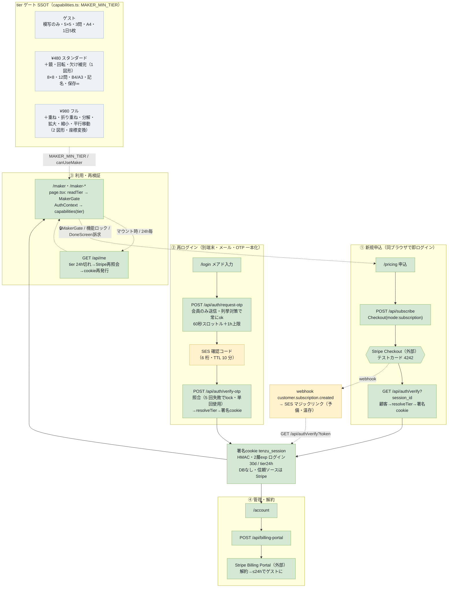

# 撤回設計: メーカー有償化＝2段サブスク＋会員ログイン（screen-flow 旧 §6）

- **撤回日**: 2026-06-26（[decisions.md §4.6](../../decisions.md)・コード撤去は 2026-06-28 §4.7 で完了）
- **代替**: per-maker 買い切り ¥980・ログインなしの所有モデル（decisions.md §4.6/§4.7/§4.8・[screen-flow.md §6](../../design/navigation/screen-flow.md)）
- **退避元**: `design/navigation/screen-flow.md` 旧 §6「会員・課金（メーカー有償化）フロー」（2026-06-21 追加・2026-06-25 OTP 化反映時点の記述）

撤回理由の要点: メーカーは主役（¥200 PDF プリント）のクロスセル商材であり、サブスク管理（tier 再検証・Billing Portal・解約・OTP 再ログイン・Upstash ストア）の運用コストが割に合わない。買い切り＋署名 cookie 所有モデルへ縮退し、OTP・`/api/subscribe`・`/api/billing-portal` は削除、`/login` は「購入の復元（マジックリンク）」・`/account` は「マイページ（購入済み一覧）」へ転用した。

---

以下、退避時点の旧 §6 全文。

## §6. 会員・課金（メーカー有償化）フロー（旧）

メーカー 10 種（公開ハブ `/makers` ＋各ツール）のサブスク有償化。2 段サブスク（¥480 スタンダード / ¥980 フル）＋無料ゲスト。タスクの幅は `MAKER_MIN_TIER`（capabilities.ts）で段階解放＝**ゲスト=模写 / スタンダード=＋鏡・回転・欠け補完（1 図形）/ フル=＋重ね・折り重ね・分解・拡大・縮小・平行移動（2 図形・座標変換）**。`/maker`（模写）はゲート無の無料、他 9 種は `MakerGate` で包み未契約は App 非マウント。**DB なし署名 cookie**で entitlement を持ち、信頼ソースは Stripe。再ログインは `/login` の **OTP（6 桁）一本化**（マジックリンクは webhook・recover の予備として温存）。test mode で①〜④を一気通貫実証済み。

凡例：🟩 実装済（test mode 実証済）／🟨 動くがオーナー本番化待ち（SES 脱サンドボックス・stripe listen）／🟥 未実装。

**実装の構成（どう作っているか・旧）**

| レイヤ | ファイル | 役割 |
|---|---|---|
| 機能ゲート SSOT | `web/app/products/capabilities.ts` | tier（guest/entry/full）× 機能（グリッド/問数/用紙/点/記名/保存/DL）＋ **`MAKER_MIN_TIER`**（どのメーカーをどの tier で開けるか）・`canUseMaker` の単一定義 |
| メーカーメタ SSOT | `web/app/products/makers.ts` | 公開 10 メーカーの表示名・説明・グループ・ルート（ハブ・MakerGate・導線が共用） |
| ページゲート | `web/app/maker/MakerGate.tsx` | 各 `/maker-*` page.tsx が `readTier`→ラップ。未契約は子（XApp）を**非マウント**にしてロック画面を表示（App 内部は不変） |
| 公開ハブ | `web/app/makers/page.tsx` | 店先（**indexed**）。5 群カード＋プランバッジ。各ツールは noindex（SEO はハブに集約） |
| 認証 | `web/app/lib/auth.ts` | Node `crypto` の HMAC 署名 cookie（**jose 不使用＝依存ゼロ**）・2 層 exp・マジックリンク／**OTP（6 桁・10 分 TTL）** 発行・検証 |
| OTP ストア | `web/app/lib/otp-store.ts` | `OtpStore` 抽象（Upstash 本番／dev メモリを env 有無で自動切替）・送信スロットル・試行回数 |
| Stripe 照会 | `web/app/lib/billing.ts` | `resolveTier`（有効サブの price→tier）・`findCustomerIdByEmail` |
| クライアント状態 | `web/app/AuthContext.tsx` | `/api/me` で現 tier 取得（マウント時・24h 再検証） |
| サーバー注入 | `web/app/maker/page.tsx`・各 `/maker-*` | cookie から初期 tier を読み props 注入（フラッシュ回避） |
| 課金 | `/api/subscribe`・webhook | Stripe subscription mode。既存 ¥200 単発（payment mode）は温存・別フロー共存 |

**旧 API ルート（撤回時に削除されたもの）**

| エンドポイント | 用途（旧） |
|---|---|
| `/api/subscribe` | サブスク Checkout 生成（plan → checkout URL） |
| `/api/auth/request-otp` | OTP 6 桁発行（Stripe照会→SES送信・列挙対策で常にok・60秒スロットル＋1h上限） |
| `/api/auth/verify-otp` | OTP 照合 → 署名cookie 発行（5 回失敗でlock・単回使用） |
| `/api/billing-portal` | Stripe Billing Portal セッション生成（解約・支払変更） |
| `/api/auth/login-link` | 会員へマジックリンク送信（予備経路・※買い切りモデルでは「購入の復元」として存続） |
