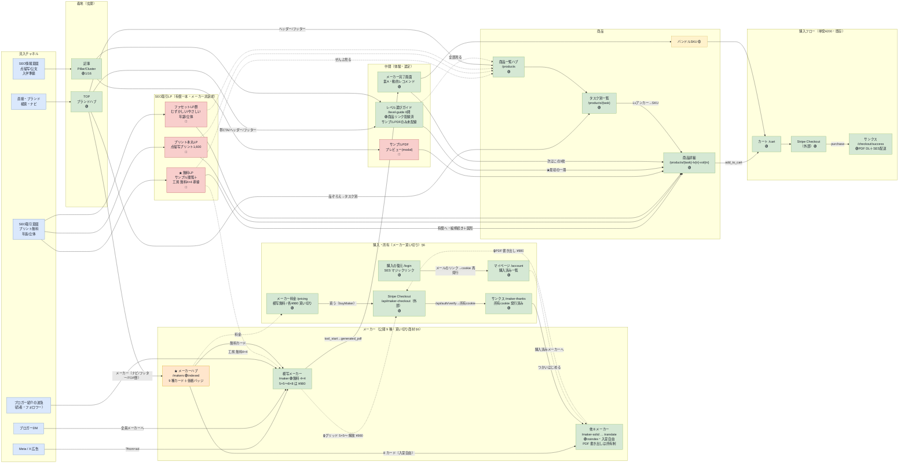
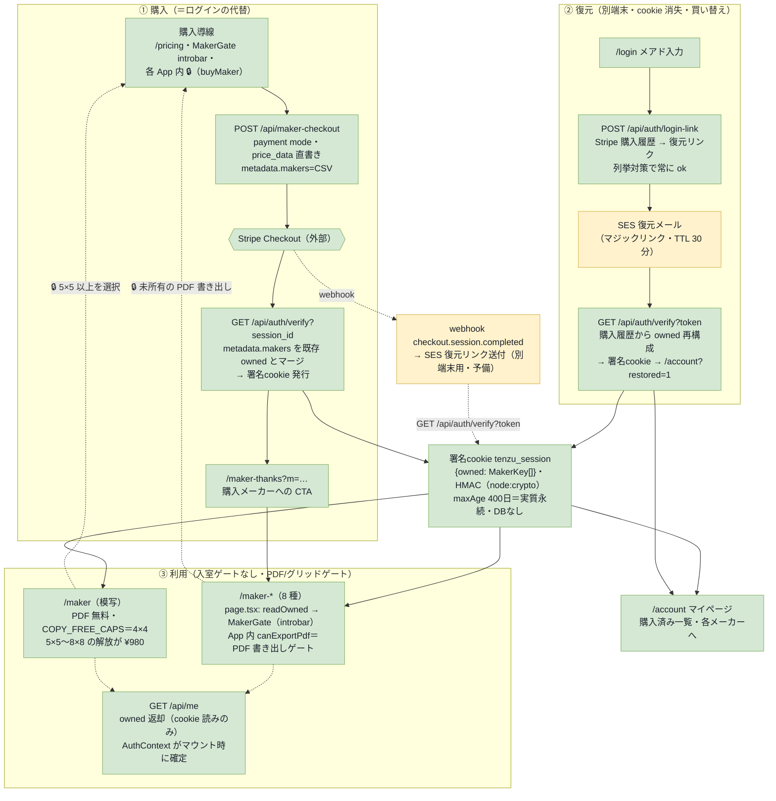

# TENZU 画面遷移マップ（流入チャネル起点）

## サマリ

- 画面遷移の**正本（SSOT）**。流入チャネル → 着地（玄関）→ 中間（体験・選定）→ 商品 → 購入フロー の5ステージで全画面の繋がりを示す。
- 形式は **Mermaid**（テキスト＝プロンプト編集前提・座標計算なし）。GitHub・VS Code・Claude アーティファクト・`tools/build-html` すべてで描画される。
- 全ページの**俯瞰ワイヤー**は [pages-overview.html](./pages-overview.html)（同ディレクトリ・単独HTML）。
- 凡例：🟢実装済 / 🔴未実装P0 / 🟡未実装後続 / ★最重要 / 破線＝ナビ・後続導線。
- 確定事項：①流入は「直接・ブランド/SEO情報/SEO取引・広告・ブロガーDM/紹介波及」（MailerLite リピーターは当面スコープ外）②**TOP がブランドハブ、商品一覧 `/products` は独立ハブ**（3層構造：TOP → /products → /products/{task} → SKU詳細）。**SEO取引意図は TOP でなく専用ファセットLPが受ける**（無料/プリント本丸/むずかしい/やさしい/年齢/立体・**有償一本**／無料LP＝サンプル閲覧＋工房（無料4×4）導線・配る無料PDFなし・[decisions.md §4.9](../../decisions.md)）③広告は独立LPを持たず **/maker?from=ad モード**で一発着地（取引LPの流し先にはしない）④**購入フロー（/cart → Stripe → /checkout/success）は実装済**（Webhook → SES メール配送まで一気通貫）⑤**レベル選びガイド `/level-guide` は実装済**（6問・2軸出力。商品リンク配線済・サンプルPDFリンクのみ未配線 href="#"）⑥**メーカー完了画面は実装済**（案A・動的レコメンド）⑦**メーカーは公開商品ライン**（公開ハブ `/makers` indexed・公開ツール9種＝`/maker` は indexed（広告着地）／他8は noindex・拡大/縮小はローンチ非公開・ヘッダー/フッター/TOP から到達・§2-3.5）⑧未実装の鍵画面：サンプルPDFプレビュー（modal）・**SEO取引ファセットLP群**。
- **メーカー有償化＝per-maker 買い切り ¥980（[§6](#6-メーカー有償化per-maker-買い切りフロー)）**：会員登録・ログインなしの**所有モデル**。購入（`/api/maker-checkout`＝Stripe Checkout payment mode・price_data 直書き → `/api/auth/verify` → `/maker-thanks`）の瞬間に署名cookie `{owned: MakerKey[]}`（HMAC・DBなし）を発行＝ログインの代替。別端末は `/login`（購入の復元・SES マジックリンク）→ `/account`。有料ゲートは**ページ入室でなく PDF 書き出し**（模写のみ例外＝PDF 無料・グリッド 5×5〜8×8 解放が ¥980）。一次定義は [decisions.md §4.6/§4.7/§4.8](../../decisions.md)・[pack-commerce.md §23](../../product/pack-commerce.md)。

## 詳細

### §1. 遷移マップ

### §2. 確定事項

1. **流入チャネル**：直接・ブランド検索・ナビ／SEO情報意図（点描写・公文・入学準備）／SEO取引意図（プリント無料・年長・立体）／Meta・X広告／ブロガーDM／ブロガー紹介の波及。MailerLite リピーター導線は当面スコープ外。
2. **TOP はブランドハブ、商品一覧は3層構造**：TOP `/` はブランドハブ＋品ぞろえ概観。商品は `/products`（一覧ハブ・リスト一枚型。旧カード型は `/products-b` に比較用退避・noindex）→ `/products/{task}`（タスク別一覧・Lvアンカー着地・準備中巻も非リンク陳列）→ `/products/{task}-lv{n}-vol{m}`（SKU詳細）の3層。SKU 構成・live/scaffold の現況は [pack-design.md §13](../../product/pack-design.md) とカタログ実装（[data.ts](../../web/app/products/data.ts)）を正とする。**SEO取引意図は TOP で受けない**——専用ファセットLP群に直接着地させる（[decisions.md §5.6](../../decisions.md)）。
2.5. **SEO取引ファセットLPは有償一本**：FV に実問題サンプル（クエリ即応）→ 有償商品紹介、が共通テンプレ。無料完結を避けるためメーカーは非訴求。**無料LP のみ「見せる無料」＝サンプル閲覧＋工房（模写メーカー・無料4×4）導線**で無料意図に応える（配る無料PDFなし・[decisions.md §4.9](../../decisions.md)・[pack-commerce.md §14.6](../../product/pack-commerce.md)）。メーカー自体の公開商品ライン化は §3.5。
3. **広告は独立LPを持たない**：`/maker?from=ad` の同一URL・モード出し分けで一発着地。冷たい Meta 流入の補助。X・ブロガーは素の `/maker` で十分。
3.5. **メーカーは公開商品ライン（公開9種・per-maker 買い切り）**：公開ハブ `/makers`（**indexed**・3群カード＋価格バッジ）が店先。`/maker`（模写）は indexed（広告・ブロガー着地）、他8ツールは noindex（SEO はハブに集約）。導線＝ヘッダー/フッター「メーカー」＋ TOP 従属セクション。**全メーカー入室自由（プレビュー可）**——有料ゲートはページ階層でなく **PDF 書き出し**（模写のみ例外＝PDF 無料・グリッド 5×5〜8×8 の解放が ¥980）。拡大・縮小は `LAUNCH_HIDDEN`（導線・カタログから除外。ルートは存続し購入済みは利用可）。entitlement SSOT は [capabilities.ts](../../web/app/products/capabilities.ts)、価格・ゲートの一次定義は [decisions.md §4.6/§4.7/§4.8](../../decisions.md)。フロー詳細は §6。
4. **購入フローは実装済**：`/cart`（CartProvider＋複数巻まとめ買い）→ Stripe Checkout（`/api/checkout` でセッション生成）→ `/checkout/success`（Stripe session_id 検証＋SkuPrintPreview でPDF DL＋ClearCartOnSuccess）。Webhook（`/api/stripe/webhook`・checkout.session.completed）→ Amazon SES 配送（プリント＝再DLリンク／メーカー買い切り＝復元マジックリンクの予備送付）。**DBなし・リンク＝既存サンクスURL**。本番化にはオーナー側で SES 検証＋ whsec_ 投入＋ SES サンドボックス脱出が必要。
5. **レベル選びガイドは実装済**：`/level-guide`（Next.js 自前ページ・6問＝最後任意・2軸出力＝軸A「はじめる位置」Lv1-5＋軸B「最初の一冊」具体SKU）。TOP帯グラフ下CTA・Hero/Close ゴースト・ヘッダー・フッターの5箇所から到達。**商品リンク配線済。サンプルPDFリンクのみ未配線**（href="#"・PDF整備待ち）。設計詳細は [funnel.md §3](../../acquisition/funnel.md)。
6. **メーカー完了画面は実装済**：案A・動的レコメンド方式。PDF書き出し後に模写（図形）ラダーから次の一冊を提案。
7. **未実装の鍵画面**：サンプルPDFプレビュー（modal）／**SEO取引ファセットLP群**（無料/プリント本丸/ファセット）／**商品ページ→工房（メーカー）のクロスセル導線**。
8. **開発専用ツール**（公開サイトには露出しない）：`/atelier`（問題検品・候補生成→採用→publish。本番は notFound()）＋ `/api/atelier/*` ＋ `/maker-solid-proto`（立体メーカー試作C案・本番未連携）。

### §3. CV イベントと導線の対応

| 区間 | イベント | 期 |
|---|---|---|
| /maker → メーカー完了画面 | `tool_start` → `generated_pdf` | 静かな開店期の主 CV |
| 商品詳細 → カート | `add_to_cart` | 本格化以降 |
| Stripe → サンクス | `purchase` | 本格化以降の主 CV |
| メーカー → /maker-thanks | メーカー買い切り購入（アタッチ率） | 計測未実装 🔴 |

### §4. 全ルート一覧（実装状況）

| ルート | 画面 | 状態 |
|---|---|---|
| `/` | TOP（ブランドハブ・品ぞろえ概観） | 🟢 |
| `/products` | 商品一覧ハブ（リスト一枚型） | 🟢 |
| `/products-b` | 商品一覧 旧カード型（比較用・noindex・不要になれば削除） | 🟢 |
| `/products/{task}` | タスク別一覧（Lvアンカー・巻カードに設問1問目サムネ＝published 連動・未入稿は白紙点格子） | 🟢 |
| `/products/{task}-lv{n}-vol{m}` | SKU詳細（live/scaffold は [pack-design.md §13](../../product/pack-design.md) 参照） | 🟢/🚧 |
| `/level-guide` | レベル選びガイド（6問・2軸出力） | 🟢 |
| `/makers` | メーカー公開ハブ（店先・9 種カード＋価格バッジ・**indexed**） | 🟢 |
| `/maker` | 模写メーカー（無料 4×4・グリッド 5×5〜8×8 は ¥980・PDF 出力は無料・indexed） | 🟢 |
| `/maker-{solid,mirror,rotate,fill,overlay,fold,decompose,translate}` | 他 8 メーカー（入室自由・PDF 書き出しは所有制 ¥980・noindex） | 🟢 |
| `/maker-{scale,shrink}` | 拡大・縮小メーカー（`LAUNCH_HIDDEN`＝導線なし・購入済みは利用可） | 🟢非公開 |
| `/maker-index` | メーカー内部リンク集（noindex・内部用） | 🟢 |
| `/pricing` | メーカー料金（模写無料／各 ¥980 買い切りカタログ） | 🟢 |
| `/login` | 購入の復元（メアド→SES マジックリンク・noindex） | 🟢 |
| `/account` | マイページ（購入済みメーカー一覧・復元案内・noindex） | 🟢 |
| `/maker-thanks` | メーカー購入サンクス（`?m=` 購入メーカーの CTA・noindex） | 🟢 |
| `/cart` | カート（複数巻まとめ買い） | 🟢 |
| `/checkout/success` | サンクス（Stripe検証＋PDF DL） | 🟢 |
| `/articles/{slug}` | 記事（1/16実装） | 🟢/🚧 |
| `/atelier`, `/atelier/{sku}` | 問題検品ツール（dev限定） | 🟢dev |
| `/maker-solid-proto` | 立体メーカー試作C案（本番未連携・noindex） | 🟢dev |
| SEO取引ファセットLP群 | 無料/本丸/ファセット | 🔴 |
| サンプルPDFプレビュー | modal | 🔴 |

### §5. API ルート一覧

| エンドポイント | 用途 | 状態 |
|---|---|---|
| `/api/checkout` | プリント Stripe セッション生成（skus → checkout URL・単発¥200） | 🟢 |
| `/api/maker-checkout` | メーカー買い切り Checkout 生成（makers → payment mode・price_data 直書き＝Price ID 不使用・metadata.makers） | 🟢 |
| `/api/stripe/webhook` | Webhook 署名検証 → SES 配送（プリント＝再DLリンク／メーカー＝復元マジックリンクの予備） | 🟢 |
| `/api/auth/verify` | 所有cookie 発行の単一入口（`?session_id`＝購入復帰→/maker-thanks／`?token`＝復元→/account。既存 owned とマージ） | 🟢 |
| `/api/auth/login-link` | 購入の復元リンク送信（Stripe 購入履歴→owned 再構成→SES・列挙対策で常に ok） | 🟢 |
| `/api/auth/logout` | 所有cookie 失効 | 🟢 |
| `/api/me` | 所有集合 `owned` 返却（署名cookie 読みのみ・Stripe 再照会なし） | 🟢 |
| `/api/atelier/*` | 問題パイプライン（generate / candidates / candidates/create / publish / ladder / vol / seed-motif-inspo） | 🟢dev |

### §6. メーカー有償化（per-maker 買い切り）フロー

メーカー（公開 9 種・ハブ `/makers`）の有償化。模写は無料コア（グリッド 4×4 まで・PDF 出力無料）、それ以外は**メーカー単位の買い切り ¥980**（月額なし・主役 ¥200 プリントのクロスセル商材）。会員登録・ログインは持たない**所有モデル**＝購入の瞬間に署名cookie `{owned: MakerKey[]}` を発行し、それがログインの代替。**DBなし**・信頼ソースは Stripe（復元時に購入履歴から owned を再構成）。有料ゲートは **PDF 書き出し**（模写のみグリッド 5×5〜8×8 の解放）で、**ページ入室はゲートしない**＝全メーカー触ってプレビューできる。価格・ゲート仕様の一次定義は [decisions.md §4.6/§4.7/§4.8](../../decisions.md)・[pack-commerce.md §23](../../product/pack-commerce.md)。ここは画面遷移と API の対応のみを持つ。

凡例：🟩 実装済（test mode 一気通貫実証済）／🟨 動くがオーナー本番化待ち（SES 脱サンドボックス・live キー・webhook 本番エンドポイント）／🟥 未実装。

**実装の構成（どう作っているか）**

| レイヤ | ファイル | 役割 |
|---|---|---|
| entitlement SSOT | [`web/app/products/capabilities.ts`](../../web/app/products/capabilities.ts) | `FREE_MAKER`（copy）・`PAID_MAKERS`（¥980×10 実装・公開9）・`PURCHASABLE_MAKERS`・`COPY_FREE_CAPS`（模写無料＝グリッド 4×4・他機能開放）・`OWNED_CAPS`（8×8・12問・B4/A3・記名・保存∞）・`canExportPdf`・`LAUNCH_HIDDEN`（scale/shrink）・`MAKER_PRICE=980` の単一定義 |
| メーカーメタ SSOT | [`web/app/products/makers.ts`](../../web/app/products/makers.ts) | 実装 11・ローンチ公開 9（`VISIBLE_MAKERS`＝LAUNCH_HIDDEN 除外）。表示名・説明・3群・ルート（ハブ・MakerGate・導線が共用） |
| 文脈バー | [`web/app/maker/MakerGate.tsx`](../../web/app/maker/MakerGate.tsx) | **入室はゲートしない**。introbar に所有状態（無料/購入済み/購入ボタン→buyMaker）を出すだけ。実ゲートは各 App 内の PDF 書き出し |
| 認証 | [`web/app/lib/auth.ts`](../../web/app/lib/auth.ts) | Node `crypto` の HMAC 署名cookie（**jose 不使用＝依存ゼロ**）。`Session{owned, exp 400日}`・`Magic{email, exp 30分}`・dev 全解放フラグ `MAKER_DEBUG_OWN_ALL` |
| Stripe 照会 | [`web/app/lib/billing.ts`](../../web/app/lib/billing.ts) | `resolveOwnedByEmail`（購入履歴→owned 再構成）・`parseMakers`（metadata 検証） |
| クライアント状態 | [`web/app/AuthContext.tsx`](../../web/app/AuthContext.tsx) | `/api/me` で owned 取得（マウント時・再検証なし＝所有は失効しない） |
| サーバー注入 | `web/app/maker/page.tsx`・各 `/maker-*` | `readOwned()` で初期 owned を props 注入（フラッシュ回避） |
| 課金 | [`/api/maker-checkout`](../../web/app/api/maker-checkout/route.ts)・webhook | payment mode・price_data 直書き（Stripe 側の商品事前登録・Price ID 不要）。既存 ¥200 プリント（`/api/checkout`）と別フロー共存 |

**残務**

- 🟨 **本番化（オーナー作業）**：**SES 脱サンドボックス（★最優先＝復元メールの前提）**／live `STRIPE_SECRET_KEY`・`STRIPE_WEBHOOK_SECRET`／`AUTH_SECRET` 本番値。チェックリスト＝`web/.env.production.example`。
- 🔴 **クロスセル導線**：商品ページ（`/products/{slug}`）→ 工房（メーカー）の送客導線。
- 🔴 **アタッチ率計測**：メーカー買い切りの CV 計測（analytics 未実装・§3）。

## 附録

- 全ページ俯瞰ワイヤー: [pages-overview.html](./pages-overview.html)
- レベル選びガイドの質問・分岐パターン詳細: [level-guide-flow.html](./level-guide-flow.html)
- 変遷:
  - 旧 draw.io 正本の退避記録 → [archive/retired-structures/2026-06-06-screen-flow-drawio.md](../../archive/retired-structures/2026-06-06-screen-flow-drawio.md)
  - 旧 §6（メーカー2段サブスク＋OTP ログイン）の退避 → [archive/retired-designs/2026-06-26-maker-subscription-screenflow.md](../../archive/retired-designs/2026-06-26-maker-subscription-screenflow.md)
