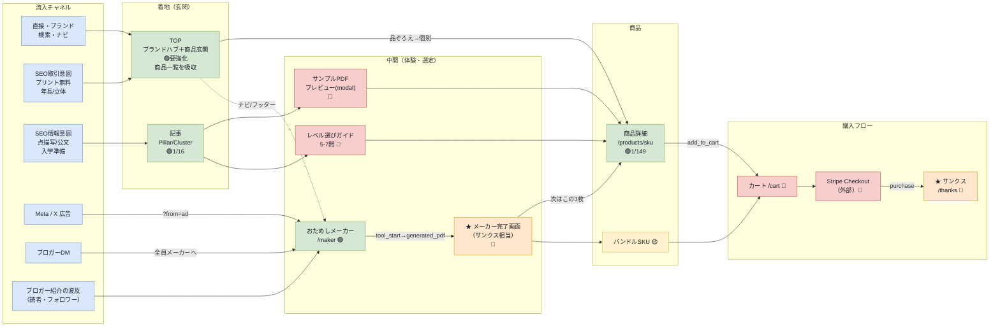

# TENZU 画面遷移マップ（流入チャネル起点）

## サマリ

- 画面遷移の**正本（SSOT）**。流入チャネル → 着地（玄関）→ 中間（体験・選定）→ 商品 → 購入フロー の5ステージで全画面の繋がりを示す。
- 形式は **Mermaid**（テキスト＝プロンプト編集前提・座標計算なし）。GitHub・VS Code・Claude アーティファクト・`tools/build-html` すべてで描画される。
- 全ページの**俯瞰ワイヤー**は [pages-overview.html](./pages-overview.html)（同ディレクトリ・単独HTML）。
- 凡例：🟢実装済 / 🔴未実装P0 / 🟡未実装後続 / ★最重要 / 破線＝ナビ・後続導線。
- 確定事項：①流入は「直接・ブランド/SEO情報/SEO取引・広告・ブロガーDM/紹介波及」（MailerLite リピーターは当面スコープ外）②**TOP が玄関兼カタログ**（商品一覧 /products を吸収・メーカーCTAは Hero 非掲載でナビ/フッター経由）③広告は独立LPを持たず **/maker?from=ad モード**で一発着地 ④購入フロー（/cart→Stripe→/thanks）は現状ゼロ＝**最優先P0** ⑤サンプルPDFプレビュー・レベル選びガイド・メーカー完了画面・サンクスが未実装の鍵画面。
- 変遷：旧正本は draw.io（`screen-flow.drawio`）。プロンプト編集に不向きなため 2026-06-06 にテキスト系へ移行（→ 附録）。

## 詳細

### §1. 遷移マップ

### §2. 確定事項

1. **流入チャネル**：直接・ブランド検索・ナビ／SEO情報意図（点描写・公文・入学準備）／SEO取引意図（プリント無料・年長・立体）／Meta・X広告／ブロガーDM／ブロガー紹介の波及。MailerLite リピーター導線は当面スコープ外。
2. **TOP が玄関兼カタログ**：商品一覧 `/products` を TOP に吸収。SEO取引意図も TOP で受ける。メーカーCTAは Hero 非掲載＝ナビ/フッター経由で到達（オーナー判断）。
3. **広告は独立LPを持たない**：`/maker?from=ad` の同一URL・モード出し分けで一発着地。冷たい Meta 流入の補助。X・ブロガーは素の `/maker` で十分。
4. **購入フロー（/cart → Stripe → /thanks）は現状ゼロ**。`purchase` を取る線が1画面も無く、**最優先P0**。
5. **未実装の鍵画面**：サンプルPDFプレビュー（modal）／レベル選びガイド／★メーカー完了画面／★サンクス。

### §3. CV イベントと導線の対応

| 区間 | イベント | フェーズ |
|---|---|---|
| /maker → メーカー完了画面 | `tool_start` → `generated_pdf` | Phase 0-1 の主 CV |
| 商品詳細 → カート | `add_to_cart` | Phase 2-3 |
| Stripe → サンクス | `purchase` | Phase 2-3 の主 CV |

## 附録

- 全ページ俯瞰ワイヤー: [pages-overview.html](./pages-overview.html)
- 変遷: [archive/retired-structures/2026-06-06-screen-flow-drawio.md](../../archive/retired-structures/2026-06-06-screen-flow-drawio.md)（旧 draw.io 正本の退避記録）
