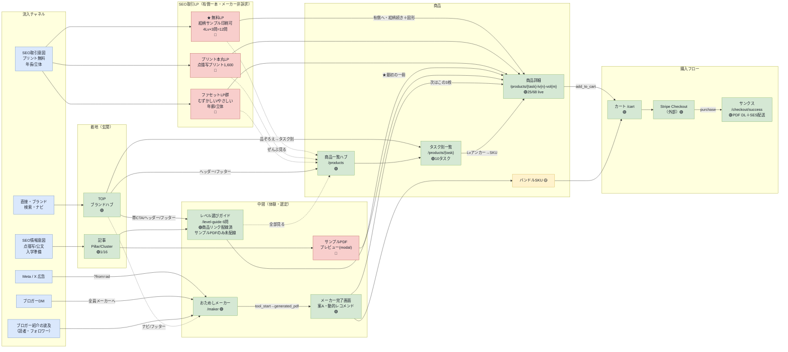

# TENZU 画面遷移マップ（流入チャネル起点）

## サマリ

- 画面遷移の**正本（SSOT）**。流入チャネル → 着地（玄関）→ 中間（体験・選定）→ 商品 → 購入フロー の5ステージで全画面の繋がりを示す。
- 形式は **Mermaid**（テキスト＝プロンプト編集前提・座標計算なし）。GitHub・VS Code・Claude アーティファクト・`tools/build-html` すべてで描画される。
- 全ページの**俯瞰ワイヤー**は [pages-overview.html](./pages-overview.html)（同ディレクトリ・単独HTML）。
- 凡例：🟢実装済 / 🔴未実装P0 / 🟡未実装後続 / ★最重要 / 破線＝ナビ・後続導線。
- 確定事項：①流入は「直接・ブランド/SEO情報/SEO取引・広告・ブロガーDM/紹介波及」（MailerLite リピーターは当面スコープ外）②**TOP がブランドハブ、商品一覧 `/products` は独立ハブ**（3層構造：TOP → /products → /products/{task} → SKU詳細）。**SEO取引意図は TOP でなく専用ファセットLPが受ける**（無料/プリント本丸/むずかしい/やさしい/年齢/立体・**有償一本・メーカー非訴求**／無料LPのみ絵柄サンプル印刷可）③広告は独立LPを持たず **/maker?from=ad モード**で一発着地（メーカーは広告/SNS入口に限定・取引LPの流し先にはしない）④**購入フロー（/cart → Stripe → /checkout/success）は実装済**（sk_test キーで Checkout 到達確認済・Webhook → SES メール配送まで一気通貫）⑤**レベル選びガイド `/level-guide` は実装済**（6問・2軸出力。商品リンク配線済・サンプルPDFリンクのみ未配線 href="#"）⑥**メーカー完了画面は実装済**（案A・動的レコメンド）⑦未実装の鍵画面：サンプルPDFプレビュー（modal）・**SEO取引ファセットLP群**。
- 変遷：旧正本は draw.io（`screen-flow.drawio`）。プロンプト編集に不向きなため 2026-06-06 にテキスト系へ移行（→ 附録）。2026-06-16 実装状況を全面反映。

## 詳細

### §1. 遷移マップ

### §2. 確定事項

1. **流入チャネル**：直接・ブランド検索・ナビ／SEO情報意図（点描写・公文・入学準備）／SEO取引意図（プリント無料・年長・立体）／Meta・X広告／ブロガーDM／ブロガー紹介の波及。MailerLite リピーター導線は当面スコープ外。
2. **TOP はブランドハブ、商品一覧は3層構造**：TOP `/` はブランドハブ＋品ぞろえ概観。商品は `/products`（一覧ハブ・帯グラフ＋3群タスク行）→ `/products/{task}`（タスク別一覧10本・Lvアンカー着地・準備中巻も非リンク陳列）→ `/products/{task}-lv{n}-vol{m}`（SKU詳細）の3層。現在25 SKU live（copy 8/fill 8/mirror 6/motif 0/solid 0/他3）、43 scaffold。**SEO取引意図は TOP で受けない**——専用ファセットLP群に直接着地させる（[decisions.md §5.6](../../decisions.md)）。
2.5. **SEO取引ファセットLPは有償一本・メーカー非訴求**：FV に実問題サンプル（クエリ即応）→ 有償商品紹介、が共通テンプレ。無料完結を避けるためメーカーへは流さない。**無料LP のみ「絵柄（模写）のレベル別サンプル PDF（入門〜発展の4Lv×各3問＝12問）を印刷可」**で無料意図に応え、続きは図形ライン中心の有償へ橋渡し（[pack-design.md §25](../../product/pack-design.md)・[§14.6](../../product/pack-design.md)）。メーカーは広告/SNS 入口に役割限定。
3. **広告は独立LPを持たない**：`/maker?from=ad` の同一URL・モード出し分けで一発着地。冷たい Meta 流入の補助。X・ブロガーは素の `/maker` で十分。
4. **購入フローは実装済**：`/cart`（CartProvider＋複数巻まとめ買い）→ Stripe Checkout（`/api/checkout` でセッション生成）→ `/checkout/success`（Stripe session_id 検証＋SkuPrintPreview でPDF DL＋ClearCartOnSuccess）。Webhook（`/api/stripe/webhook`・checkout.session.completed）→ Amazon SES でマジックリンク再DLメール配送。**DBなし・リンク＝既存サンクスURL**。本番化にはオーナー側で SES 検証＋ whsec_ 投入＋ SES サンドボックス脱出が必要。
5. **レベル選びガイドは実装済**：`/level-guide`（Next.js 自前ページ・6問＝最後任意・2軸出力＝軸A「はじめる位置」Lv1-5＋軸B「最初の一冊」具体SKU）。TOP帯グラフ下CTA・Hero/Close ゴースト・ヘッダー・フッターの5箇所から到達。**商品リンク配線済。サンプルPDFリンクのみ未配線**（href="#"・PDF整備待ち）。設計詳細は [funnel.md §3](../../acquisition/funnel.md)。
6. **メーカー完了画面は実装済**：案A・動的レコメンド方式。PDF書き出し後に模写（図形）8段ラダーから次の一冊を提案。
7. **未実装の鍵画面**：サンプルPDFプレビュー（modal）／**SEO取引ファセットLP群**（無料/プリント本丸/ファセット）。
8. **開発専用ツール**（公開サイトには露出しない）：`/atelier`（問題検品・候補生成→採用→publish。本番は notFound()）＋ `/api/atelier/*`（generate/candidates/publish）。

### §3. CV イベントと導線の対応

| 区間 | イベント | フェーズ |
|---|---|---|
| /maker → メーカー完了画面 | `tool_start` → `generated_pdf` | Phase 0-1 の主 CV |
| 商品詳細 → カート | `add_to_cart` | Phase 2-3 |
| Stripe → サンクス | `purchase` | Phase 2-3 の主 CV |

### §4. 全ルート一覧（実装状況）

| ルート | 画面 | 状態 |
|---|---|---|
| `/` | TOP（ブランドハブ・品ぞろえ概観） | 🟢 |
| `/products` | 商品一覧ハブ（帯グラフ＋3群タスク行） | 🟢 |
| `/products/{task}` | タスク別一覧（10タスク・Lvアンカー） | 🟢 |
| `/products/{task}-lv{n}-vol{m}` | SKU詳細（25 live / 43 scaffold） | 🟢/🚧 |
| `/level-guide` | レベル選びガイド（6問・2軸出力） | 🟢 |
| `/maker` | おためし点描写メーカー（PDF出力） | 🟢 |
| `/cart` | カート（複数巻まとめ買い） | 🟢 |
| `/checkout/success` | サンクス（Stripe検証＋PDF DL） | 🟢 |
| `/articles/{slug}` | 記事（1/16実装） | 🟢/🚧 |
| `/atelier`, `/atelier/{sku}` | 問題検品ツール（dev限定） | 🟢dev |
| SEO取引ファセットLP群 | 無料/本丸/ファセット | 🔴 |
| サンプルPDFプレビュー | modal | 🔴 |

### §5. API ルート一覧

| エンドポイント | 用途 | 状態 |
|---|---|---|
| `/api/checkout` | Stripe セッション生成（skus → checkout URL） | 🟢 |
| `/api/stripe/webhook` | Webhook 検証 → SES メール配送 | 🟢 |
| `/api/atelier/generate` | 問題生成（Lv+grid → SVG） | 🟢dev |
| `/api/atelier/candidates` | 候補一覧取得 | 🟢dev |
| `/api/atelier/publish` | 候補 → published 昇格 | 🟢dev |

## 附録

- 全ページ俯瞰ワイヤー: [pages-overview.html](./pages-overview.html)
- レベル選びガイドの質問・分岐パターン詳細: [level-guide-flow.html](./level-guide-flow.html)
- 変遷: [archive/retired-structures/2026-06-06-screen-flow-drawio.md](../../archive/retired-structures/2026-06-06-screen-flow-drawio.md)（旧 draw.io 正本の退避記録）
